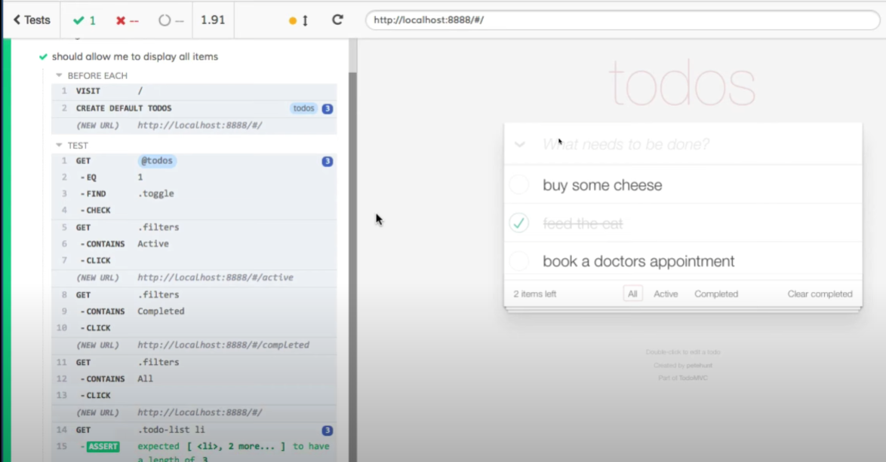

### Cypress is a tool for E2E and integration testing
- It is framework-agnostic.
- Installed via npm with `npm install cypress`.
- Ships with an Electron-based browser which is a barebone version of Chromium.
- (The test runner, Mocha) Cypress shares the same domain name as the web page under test.
### Resources
- https://www.youtube.com/watch?v=avb-VDa3ZG4
- https://www.youtube.com/watch?v=YV3qPvhJ-rg
### Motivation
- We want to ensure changes are not breaking. We write tests for features such that eventual breaking changes will not reach production rather these will be caught within the build pipeline.

- In the above image we identify the web page that is tested (right hand-side, wrapped in an iframe) and on the left hand-side, the test suite.
- Cypress is more entrusting than `Selenium` as it sits inside the browser and runs the tests using `JS`. This is possible through a `Node` process that acts as a task runner. This means more
control over the process. A possible downside are event that are native such as double clicks. 
- It is supported on all OSes and major browsers.

### Recommendations
- Keep E2E & integration tests in the same directory (as once CI/CD is set up, the tests can be run from the repo).
- Cypress should be installed as a package dependency for individual projects. If installed globally, for nested projects, it might have breaking changes (dependent on the versioning).

### Setup (using any terminal, Hyper, Bash)
1. Create the test project directory, run `mkdir folderName`, for example `mkdir cypress-testing`.
2. Cd into the newly created directory.
3. Once entered, in the test folder, run `npm init` or `yarn init` to create a node project.
4. Afterwards, a package.json file will be created in the directory, it holds all the project dependencies.
5. Run `npm i cypress` to install the cypress package from npm.
6. Once Cypress is installed, we can open it by using `npx cypress open` (this will open a window, the test runner).

### Cypress setup structure
```
rootProject (where the test project resides)
    |
    |--->cypress
           |----> fixtures
           |----> integration
           |----> plugins
           |----> support
```
- Within the `Settings` tab, we can find the configuration file, in json format which can be edited.

### The Cypress Runner
- Individual test suites can be run (spec file)
- All tests can be run (project level)
- All tests are run <em>asynchronous</em>.

### Creating a test suite
- By adding `/// <reference types="cypress" />` at the top of the file, we specify types within the spec file. This concept
is similar to `TS` types.

### Comparison to other testing libraries
- Jest will mark empty tests as empty whilst in Cypress, the empty test passes.

### How to run headless
- In a CI/CD environment, we need to run headless (running the tests without a GUI), this can be done by running `npx cypress run --headless`.
- In development, however, it is recommended to not run headless.

### Fixtures
```
rootProject (where the test project resides)
    |
    |--->cypress
           |----> fixtures
```
- Sometimes, API calls are expensive, however we still need to test the API response(s), this can be achieved by using json files in which the structure 
of the data is represented (See `example.json`, the default Json created when installing Cypress).
- Cypress provides support for using these static files once created from within the fixtures' directory.
### Integration
```
rootProject (where the test project resides)
    |
    |--->cypress
           |----> ...
           |----> integration
```
- Each file will contain 1..* `describe` blocks, it is recommended to have only 1 per spec file.
- The spec file can contain multiple tests which should be atomic (independent of each other).
- <strong>Structure (per spec):</strong>
```
    describe() <---- suite
        |
        |----> it   <---|
        |----> it   <---|---- Tests
        |----> it   <---|
```

### Plugins
```
rootProject (where the test project resides)
    |
    |--->cypress
           |----> ...
           |----> ...
           |----> plugins
```
- The `plugins` directory is used to extend the functionality of Cypress.
- Example use case: oAuth with Google, this can be tested using Puppeteer under the hood.

### Support
- Directory for reusable code, an example use case would be the authentication process given that it involves
several steps.

### Videos
- Directory containing video recordings of test suite execution.
- Especially useful when verifying tests executed within the CI/CD pipeline.

### Anatomy
```
     |---------- Test suite definition
     |          |----- Test suite name
describe('Basic test', () => {
    |-------------------------------- A test
    it('We have a correct tile', () => {
        cy.visit('https://codedamn.com');   <--- Accessor of the web page under test
        cy.contains('Videos are so').should('exist');   <--- Test/Assertion, the '.should('exist')' is from Mocha, could be omitted.
    });
});
```
### Specifications
- When using `cy.contains('text')` the assertion will be valid even with partial text, i.e. the page contains a header with
"On alert brothers, the enemy must be nearby...", if in a test we specify `cy.contains('On alert')` or `cy.contains('On alert brothers, the enemy must be nearby...')`
both will be valid tests. `cy.contains()` tests whether the entire pages contains the text given as argument.
- `cy.get(element)` will return the total count of the specified element, i.e. cy.get('div') will return the total count of divs
within the page.
- Using composite selectors, `cy.get('div#root).should('exist')` will assert whether an element with the `id` of `root` is present within a `div`.
- Negations, ex.: `cy.get('div#noroot').should('not.exist')` will asset that there is no element with the `id` of `noroot` within a `div`.
- Any selector can be used with `cy.get(selector)`.
- We should avoid using non-identifiable classes. Instead, we can use `custom-attributes`, for example `data-testid="someLabel"` (not prone to change).
- By adding `.only` to a test, ex.: `it.only` we specify to cypress that it should run only the specified test case. This is handy in the development process
of test(s).

### Should
- We use a property from an element and assert on it, i.e. if the text of a button is matching a specific value.
- `should('have.text')` is an assertion on exact match.
- `should('eq')` is an assertion on equality.
- `cy.url().should('include', 'uri')` will assert whether the specified uri is present or not on the accessed page.
- Multiple properties can be used for different assertions.

### Viewport adjustment
- We can use different viewport configuration:
  - `cy.viewport(1280,720)`, set specific W x H
  - `cy.viewport('iphone-5)`, set mobile device sizes
  - `cy.viewport('macbook-15')`, set PC sizes

### Logging
- Done by using `cy.log(message)`, then the log(s) appear in the left hand-side pane of the cypress test runner with the label `log`.

### Logging in
- Note, Cypress states that using its functionalities to test logging in/authentication is an anti-pattern.

### Add Cucumber
- Install with `npm i cypress-cucumber-preprocessor`.

### Feature files
- Should be capitalized and have the extension `.feature`.
- Comments can be added using `#`.
- There can only be 1 feature per feature file, and it has to be at the root level.
- `Scenario` groups the `given`, `when` and `then` clauses.
- Both `Scenario` and `Feature` clauses should be as descriptive (textual and concise) as possible.

#### Structure
```
Feature: featureName
  Scenario: featureAction
    Given: context setup (before)
    When: action performed
    Then: actual expectation (result)
```